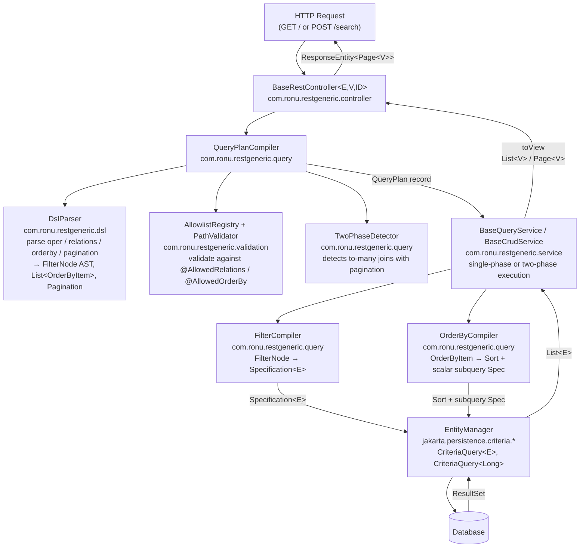

# rest-generic-class — Introduction and Architecture

## The Problem: REST CRUD Boilerplate in JPA Projects

Every Java Spring Boot project that exposes a relational database via REST faces the same set of recurring problems:

1. **Repetitive controller/service pairs.** Each entity requires a nearly identical controller, service, and repository class with the same list, show, create, update, delete, bulk-create, bulk-update, and bulk-delete methods.
2. **Ad-hoc filtering.** Teams invent their own query-parameter conventions, leading to inconsistent APIs across resources and increasing maintenance burden.
3. **Unguarded relation loading.** Without an explicit allowlist, a caller can ask the server to eagerly load any related entity graph, creating N+1 DoS attack vectors.
4. **Silent in-memory pagination.** When Hibernate fetches a collection join alongside a `LIMIT`/`OFFSET` clause, it silently loads the entire result set into memory and slices it in the JVM. This is catastrophic at scale and hard to detect in code review.
5. **javax/jakarta namespace conflicts.** Blaze-Persistence 1.6.x was written against `javax.persistence.*`, while Spring Boot 3 moved to `jakarta.persistence.*`. Using Blaze's raw query API directly causes classpath conflicts.

`rest-generic-class` solves all five problems with a single, opinionated library that is thin enough to be overridden everywhere.

---

## Design Philosophy

### Security-First Allowlist Model

Every relation path and every orderby path must be explicitly declared on the entity class via annotations before the library will accept it. An undeclared path results in an HTTP 400 response before any SQL is executed. This eliminates an entire class of DoS attacks by construction.

### Entities Never Reach the REST Layer

All public endpoints return a **view type** `V`, not the entity type `E`. The abstract `toView(E)` method is the only bridge between the JPA world and the response body. This enforces the boundary between persistence and transport at the type level.

### Records and Sealed Interfaces for Type Safety

All DSL models are Java **records** (`DynamicQueryRequest`, `QueryPlan`, `Pagination`, `OrderByItem`). Records are immutable, have structural equality, and require no boilerplate. The filter AST uses a **sealed interface**:

```java
public sealed interface FilterNode permits GroupNode, ConditionNode, RelationFilterNode {}
```

Because `FilterNode` is sealed, every `switch` expression over it is exhaustively checked by the compiler. If a new node type is added in the future, the compiler will flag every switch that does not handle it.

### `@ConditionalOnMissingBean` on Every Auto-Configured Bean

Every bean registered by `RestGenericAutoConfiguration` carries `@ConditionalOnMissingBean`. If your application defines its own `DslParser`, `FilterCompiler`, `OrderByCompiler`, `AllowlistRegistry`, `PathValidator`, `TwoPhaseDetector`, `QueryPlanCompiler`, or `GlobalExceptionHandler`, the auto-configured version is silently skipped. You can replace any single component without forking the library.

### Pure `jakarta.persistence.criteria.*` for Query Execution

All JPA Criteria API usage is against `jakarta.persistence.criteria.*` exclusively. This sidesteps the javax/jakarta namespace conflict with Blaze-Persistence 1.6.x. Blaze Entity Views are an optional integration at the view layer — the library's query core does not touch Blaze's raw API at all.

---

## Architecture Diagram



---

## Layer-by-Layer Explanation

### 1. Controller Layer — `com.ronu.restgeneric.controller`

`BaseRestController<E, V, ID>` is an abstract Spring `@RestController` that exposes 10 endpoints (see table below). It holds a single abstract method `service()` that returns the concrete `BaseCrudService`. The controller is responsible only for HTTP concerns: deserializing the request body into a `DynamicQueryRequest`, delegating to the service, and wrapping the result in `ResponseEntity`.

| HTTP Method | Path         | Description                                  |
|-------------|--------------|----------------------------------------------|
| GET         | /            | List with optional query-param DSL           |
| POST        | /search      | Full JSON DSL body search (primary endpoint) |
| GET         | /{id}        | Show single entity                           |
| GET         | /{id}/with   | Show single entity with explicit relations   |
| POST        | /            | Create single                                |
| PUT         | /{id}        | Update single                                |
| POST        | /bulk        | Bulk create                                  |
| PUT         | /bulk        | Bulk update (each item must include `id`)    |
| DELETE      | /{id}        | Delete single                                |
| DELETE      | /bulk        | Bulk delete (IDs in request body)            |

### 2. DSL Layer — `com.ronu.restgeneric.dsl`

`DslParser` parses the four top-level fields of `DynamicQueryRequest` into typed structures:

- **`oper`** (`Map<String, Object>`) → `Optional<FilterNode>` (an AST of `GroupNode`, `ConditionNode`, `RelationFilterNode`)
- **`orderby`** (`List<Map<String, String>>`) → `List<OrderByItem>`
- **`relations`** (`List<String>`) → `List<String>` (validated copy)
- **`pagination`** (`Pagination`) → `Pagination` (clamped to page >= 1, pageSize in 1..1000)

All DSL model types are Java records in `com.ronu.restgeneric.dsl.model`:

| Record / Enum          | Role                                                         |
|------------------------|--------------------------------------------------------------|
| `DynamicQueryRequest`  | Top-level request body                                       |
| `FilterNode` (sealed)  | Sum type: root of filter AST                                 |
| `GroupNode`            | AND/OR logical group, holds `List<FilterNode>` children      |
| `ConditionNode`        | Leaf: `path`, `FilterOp`, `List<String> values`              |
| `RelationFilterNode`   | Relation-scoped filter (`whereHas` equivalent)               |
| `FilterOp`             | Enum of 23 operators (EQ, NE, LIKE, IN, BETWEEN, NULL, ...)  |
| `LogicalOp`            | AND / OR                                                     |
| `OrderByItem`          | `path` + `Direction` (ASC/DESC)                              |
| `Pagination`           | `page`, `pageSize`, with `toPageable()`, `offset()`, `limit()`|
| `QueryPlan`            | Validated, compiled plan consumed by the service layer        |

### 3. Validation Layer — `com.ronu.restgeneric.validation`

`AllowlistRegistry` is a thread-safe, in-process registry backed by `ConcurrentHashMap`. On first use of an entity class, `QueryPlanCompiler` calls `registry.register(entityClass)`, which reads `@AllowedRelations` and `@AllowedOrderBy` annotations and caches the allowed sets. Subsequent calls are O(1) hash lookups.

`PathValidator` validates individual paths by:
1. Checking the registry allowlist for the entity class.
2. Walking the JPA `Metamodel` to determine whether the path ends in a `PluralAttribute` (to-many) or a `SingularAttribute` (to-one/scalar). This metamodel walk drives the two-phase decision.

### 4. Query Layer — `com.ronu.restgeneric.query`

`QueryPlanCompiler` orchestrates parsing and validation and produces a `QueryPlan` record. `QueryPlan` is immutable and contains everything needed to execute the query:

```java
public record QueryPlan(
    FilterNode filterTree,
    List<OrderByItem> orderItems,
    List<String> requestedRelations,
    boolean requiresTwoPhase,
    Pagination pagination,
    Map<String, Boolean> relationIsToMany   // top-level segment → is collection?
) {}
```

`FilterCompiler` translates the `FilterNode` AST into a `Specification<E>` using exhaustive pattern matching on the sealed interface. Each operator maps directly to a JPA Criteria builder call (`cb.equal`, `cb.like`, `cb.between`, correlated `EXISTS` subquery for relation filters, etc.).

`OrderByCompiler` splits `OrderByItem` directives into:
- **Scalar Sort** (`Sort` object) — for local fields and to-one relational paths. Spring Data applies these as `ORDER BY` clauses on the main query.
- **Subquery Spec** (`Specification<E>`) — for to-many relational paths. A correlated scalar subquery with `SELECT LIMIT 1` is injected into the `CriteriaQuery` to avoid duplicate rows from a collection join.

`TwoPhaseDetector` inspects the requested relations list and returns `true` if any top-level relation is a to-many collection **and** pagination is requested. The two-phase strategy is the safe default for this scenario.

### 5. Service Layer — `com.ronu.restgeneric.service`

`BaseQueryService<E, V>` implements the two execution strategies:

- **Single-phase**: count query + entity fetch with pagination applied directly. Safe when no to-many collection joins are present.
- **Two-phase**: Phase 1 selects only `id` values with `LIMIT/OFFSET`. Phase 2 fetches full entities `WHERE id IN (...)` without pagination. No cartesian product, no in-memory slicing.

`BaseCrudService<E, V, ID>` extends `BaseQueryService` and adds `create`, `update`, `delete`, `bulkCreate`, `bulkUpdate`, `bulkDelete`. Write operations use `EntityManager.persist/merge/remove` directly inside `@Transactional` methods. `newInstance()` and `mapData()` are extension points — override them with MapStruct, ModelMapper, or your own factory logic.

---

## Key Design Decisions

### Sealed Interface for the Filter AST

```java
public sealed interface FilterNode permits GroupNode, ConditionNode, RelationFilterNode {}
```

`FilterCompiler.toPredicate()` uses a `switch` expression over `FilterNode`. Because the interface is sealed, the Java compiler enforces exhaustiveness — every permit type must be handled. Adding a new node type in the future without updating every switch is a compile error, not a runtime `NullPointerException`.

### All DSL Models are Records

Records bring three properties that are essential for a pipeline model:

1. **Immutability** — a `QueryPlan` constructed by `QueryPlanCompiler` cannot be mutated by the service layer.
2. **Structural equality** — useful in tests and caching without custom `equals`/`hashCode`.
3. **Compact syntax** — no getter/setter boilerplate for data carriers.

### Jakarta-only Criteria API

The library never imports `javax.persistence.*`. All JPA usage is `jakarta.persistence.criteria.*`, `jakarta.persistence.EntityManager`, and `jakarta.persistence.metamodel.*`. Blaze-Persistence 1.6.x ships both `javax` and `jakarta` modules, but the core library avoids touching Blaze's raw query builder entirely, so the namespace clash never arises.

### `@ConditionalOnMissingBean` Everywhere

Every bean in `RestGenericAutoConfiguration` is gated by `@ConditionalOnMissingBean`. This is not just a convention — it is the primary extensibility contract of the library. Any bean can be replaced at application scope without modifying the library.

---

## Comparison: PHP vs Java Implementation

Both implementations share the same JSON DSL contract. A front-end or API client written against the PHP library can communicate with the Java library unchanged, because the wire format is identical.

| Aspect                   | PHP (Laravel)                          | Java (Spring Boot 3)                                          |
|--------------------------|----------------------------------------|---------------------------------------------------------------|
| Filtering DSL            | `oper` JSON, pipe-separated strings    | Same — parsed by `DslParser`                                  |
| Relation loading         | Eloquent `with()`                      | JPA EntityGraph / Criteria join                               |
| Allowlist enforcement    | `const RELATIONS = [...]` on model     | `@AllowedRelations` annotation, `AllowlistRegistry`           |
| Orderby allowlist        | `const ORDERBY = [...]`                | `@AllowedOrderBy` annotation                                  |
| Filter operators         | 23 string operators                    | `FilterOp` enum, 23 values, same symbols                      |
| Relation filter          | `whereHas()` closure                   | Correlated `EXISTS` subquery via `RelationFilterNode`         |
| Pagination               | `LengthAwarePaginator`                 | Spring Data `Page<V>` / `PageImpl<V>`                         |
| Two-phase pagination     | Manual in service                      | `TwoPhaseDetector` + `searchTwoPhase()`                       |
| Cache invalidation       | `const CACHE_INVALIDATES = [...]`      | `@CacheInvalidates(Class<?>[] value)` annotation              |
| Field visibility by role | `protected $fieldsByRole = [...]`      | `@FieldsByRole` / `@FieldsByRole.RoleFields` annotations      |
| View layer               | API Resources / Transformers           | Abstract `toView(E)` — or Blaze Entity Views                  |
| Override granularity     | Extend controller/service              | `@ConditionalOnMissingBean` on every auto-configured bean     |
| Wire format for response | Laravel paginator JSON                 | Spring Data `Page<V>` JSON (`content`, `totalElements`, etc.) |
